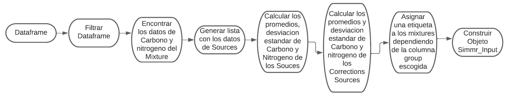

# TPtoSimmr

Genera una lista de objetos de la clase Simmr_Input analizando un marco de valores de isotopos estables, analizados para un consumidor y uno o mas lineas de baselines, el filtro puede ser una o mas Estudios, Localidades,SPP,etc.




para utilizar TPtoSimmr se requieren instalar las siguientes librerias:
```{r message=FALSE}
library(simmr)  
library(tRophicPosition)  
library(tidyverse)  
library(xlsx)  
```

 

```{r echo=F}
source('TptoSimmr.R')
```

crearemos valores de entrada para dar un ejemplo de como utilizar la funcion, en este caso seran:
```{r echo=t}
filtro1="MEC"#STUDY
filtro2=NULL#LOCATION
filtro3=NULL  #SPP
filtro4= NULL#NS
lista<-list(filtro1,filtro2,filtro3,filtro4)
lista
  
  
```

```{r echo=t}
column1="Study"
column2="Location"
column3="Spp"
column4="NS"
columnas<-c(column1,column2,column3,column4)
columnas
```

```{r}
var<-matrix(ncol = 2,nrow=2) 
var[1,1]<-10
var[1,2]<-NA
var[2,1]<-NA
var[2,2]<-10
var
ruta=system.file("extdata","Bilagay_for_tRophicPosition.xlsx", 
                package = "tRophicPosition")
datos2<-read.xlsx(ruta,1)
head(datos2)
```
luego de crear valores de entrada llamamos a la funcion
```{r message=FALSE}
resultados1<-TPtoSimmr(datos=datos2,
                    filtro=lista,
                    columnass=columnas,
                    mixture= "Bilagay",
                    baselines=c("Pelagic_BL","Benthic_BL"),
                    baseColumn="FG",
                    mixtureColumn="FG",
                    ColumnC="d13C",
                    ColumnN="d15N",
                    correctionsMeans=var,
                    correctionsSD=var,
                    columnGroup=NULL)

```
Visualizamos los Resultados
```{r}
str(resultados1)
```
# comprobar que los corrections tengan correctamente la columna Carbono y nitrogeno

```{r echo=FALSE}
va1<-sapply(TDF(), mean)
va2<-sapply(TDF(), sd)
```
```{r message=FALSE}
va1 #PROMEDIO
va2 #SD
```


```{r}
resultados1$correction_means
resultados1$correction_sds
```

```{r}
plot(resultados1)
```


# SimmrToTP
Recoge los datos de un archivo para generar una lista de la clase isotopeData con los datos de los consumidores y sources.


para utilizar SimmrtoTp se requieren las siguientes librerias
```{r message=FALSE}
library(simmr)  
library(tRophicPosition)  
library(tidyverse)  
library(xlsx)  
```

```{r echo=F}
source('simmrtotp.R')
```
llamamos a la funcion

```{r message=FALSE}
resultados2<-SimmrtoTP(df="geese_data.xls",
                    numpestanatotal=4,
                    columnCc="d13C_Pl",
                    columnNc="d15N_Pl",
                    ubipestcolumnCN=1,
                    Sources=c("Zostera","Grass","Enteromorpha","U.lactuca"),
                    columnSources="Sources",
                    ubipestcolumnSources=2,
                    ubipestTefs=3,
                    ubipestConcDep=4,
                    meancolumnC="meand13CPl",
                    meancolumnN="meand15NPl",
                    sdcolumnC="SDd13C",
                    sdcolumnN="SDd15N",
                    meanteftcolumnC="meand13CPl" ,
                    meanteftcolumnN= "meand15NPl",
                    sdteftcolumnC="SDd13C" ,
                    sdteftcolumnN= "SDd15N",
                    CondepC="d13CPl",
                    CondepN="d15NPl"
                  )
```
visualizamos los resultados

```{r}
str(resultados2)
```
```{r}
plot(resultados2)
```

observaciones: existen los valores delta pero no estan integrados en el grafico, solo grafica 2 sources.

# De Simmr_Input a isotopeData
Toma una lista de la clase Simmr_input y la devuelve a formato IsotopeData

```{r echo=F}
source('classfunction1.R')
```
utilizamos el resultado de la funcion TpToSimmr para pasarlo a estructura isotopeData
```{r}
resultados3<-classfunction(datos=resultados1)
```
Visualizamos los resultados
```{r}
str(resultados3)
```
# Comparacion resultado 3 (de clase Simmr a isotopedata) con resultado 1 (objeto Simmr de iguales caracteristicas)

```{r}
plot(resultados3)
plot(resultados1)
```


como se puede observar los graficos no son iguales, debido a que la clase isotopeData esta omitiendo los deltas, veremos que pasa si cambiamos la matriz de corrections_means y corrections_sds a 0 y realizamos la misma prueba

```{r}
var<-matrix(ncol = 2,nrow=2) 
var[1,1]<-0
var[1,2]<-0
var[2,1]<-0
var[2,2]<-0
var
```

```{r}
resultados5<-TPtoSimmr(datos=datos2,
                    filtro=lista,
                    columnass=columnas,
                    mixture= "Bilagay",
                    baselines=c("Pelagic_BL","Benthic_BL"),
                    baseColumn="FG",
                    mixtureColumn="FG",
                    ColumnC="d13C",
                    ColumnN="d15N",
                    correctionsMeans=var,
                    correctionsSD=var,
                    columnGroup=NULL)

```

```{r}
plot(resultados5)
```

```{r}
plot(resultados3)
```

los graficos se encuentran en la misma pocision en el plano.


# De IsotopeData a Simmr_input
Toma una lista de la clase Isotopedata y la devuelve a formato Simmr_input
```{r echo=F}
source('classfunction2.R')
```
utilizamos el resultado de la funcion  de SimmrtoTP
```{r}
resultados4<-classfunction2(datos=resultados2)

```
visualizamos el resultado de pasar la estructura de la funcion SimmrtoTP
```{r}
str(resultados4)

```
# Comparacion de resultado 4 (de clase isotopeData a Simmr_input) con resultado 2 (funcion SimmrtoTP)


```{r}
plot(resultados4)
```


```{r}
plot(resultados2)
```


observaciones: los Sources comunes en este caso(Zostera y Grass) no estan en la misma pocision del grafico, esto es debido a que el plot del resultados4 (de pasar la clase isotopedata a Simmr_input) tiene corrections means y corrections sds, en el resultado2 (funcion SimmrtoTP) tiene deltas pero no estan integrados en el grafico, asi que para probar que sean iguales los graficos dejaremos en cero los campos de corrections means y corrections sds del resultados 4 correspondiente a grass y zostera.


```{r}
resultados4$correction_means[1,1]<-0
resultados4$correction_means[1,2]<-0
resultados4$correction_means[2,1]<-0
resultados4$correction_means[2,2]<-0
resultados4$correction_sds[1,1]<-0
resultados4$correction_sds[1,2]<-0
resultados4$correction_sds[2,1]<-0
resultados4$correction_sds[2,2]<-0
resultados4$correction_means
resultados4$correction_sds
```

```{r}
plot(resultados4)
plot(resultados2)
```

graficos iguales
